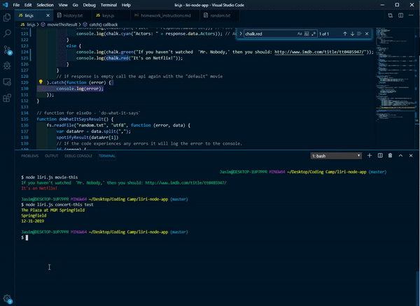
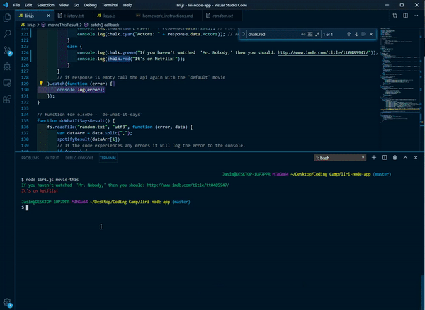
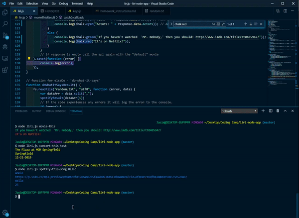
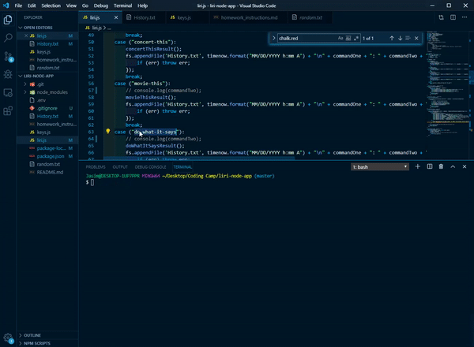

# liri-node-app

After cloning this app the user must creat a .env file with

*Spotify API keys*

**SPOTIFY_ID=your-spotify-id**

**SPOTIFY_SECRET=your-spotify-secret**

*******   **spotify this song**  ***********

*******   **concert this**  ***********

*******   **movie this Matrix**  ***********

*******   **movie this case of no empty command**  ***********

*******   **do what it says**  ***********

*******   **history of commands**  ***********

